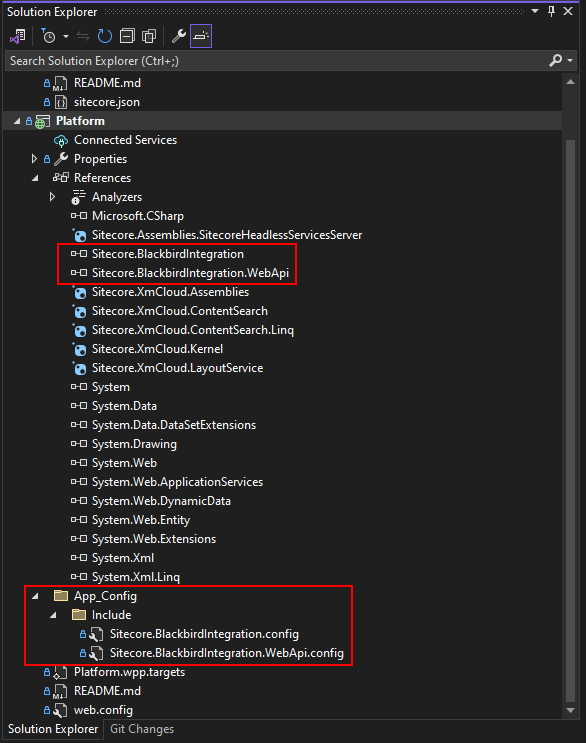
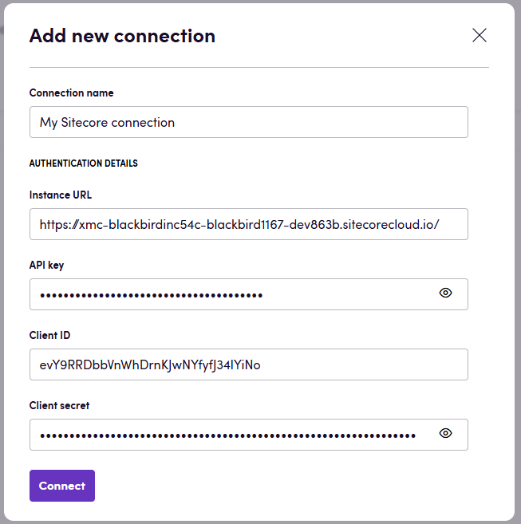
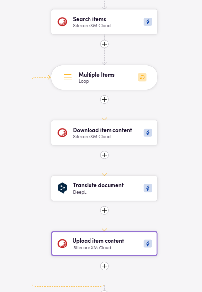

# Blackbird.io Sitecore XM Cloud

Blackbird is the new automation backbone for the language technology industry. Blackbird provides enterprise-scale automation and orchestration with a simple no-code/low-code platform. Blackbird enables ambitious organizations to identify, vet and automate as many processes as possible. Not just localization workflows, but any business and IT process. This repository represents an application that is deployable on Blackbird and usable inside the workflow editor.

## Introduction

<!-- begin docs -->

Sitecore is one of the leading enterprise-level content management systems, enabling web content editors and marketers to have full control over all aspects of their website from social integration and blog posts to advanced personalisation, ecommerce and more. This app focusses on the integration between Sitecore items, languages and the rest of the Blackbird ecosystem. Contrary to other Blackbird apps, in order to get up and running you need to install a custom-built plugin on your Sitecore instance.

This app is built for Sitecore XM Cloud. For Sitecore XP see [this guide](https://docs.blackbird.io/apps/sitecore-xp/) instead.

## Before setting up

Before you can connect you need to make sure that:

- You have access to XM Cloud Deploy, its credential management and an active Sitecore project.
- You have access to the source code repository (Github) of a Sitecore project and the ability to configure new plugins.
- You have downloaded the latest Blackbird Sitecore plugin package from [here](https://docs.blackbird.io/sitecore/package.zip).

## Installing the plugin

Assuming your source content repository is forked form this [repo](https://github.com/sitecorelabs/xmcloud-foundation-head).

1. Extract the files from [package.zip](https://docs.blackbird.io/sitecore/package.zip)
2. Copy the 2 config files from `package\files\App_Config\Include\BlackBird` in the package to `authoring\platform\App_Config\Include\` in the source code repository.
3. Copy the 2 dll files from `package\files\bin` in the package to `authoring\platform\_dlls` in the source code repository.
4. Open the `XmCloudAuthoring.sln` in Visual Studio (or any other .NET compatible IDE) and add references to the added .dll files in the Platform project.
5. Also include file references to the 2 config files.

Your solution should look something like this now:

6. Build and/or push your code so that a redeployment is triggered.

## Creating an API key

1. Go to _Content Editor_.
2. Navigate to _System -> Settings -> Services -> API Keys_.
3. Insert a new API Key item.

4. Populate the following fields:
   - Allowed controllers: set to _\*_ or choose controllers.
   - Impersonation User: the request will be executed as this user. Sitecore admin can create users with some limitations if needed. Anonymous users will be impersonated as this user if the field value is empty.
5. Publish the item.

6. Copy the Item ID (including the parentheses) - this is your key and can be used in the next steps.

## Creating an XM Cloud Client

1. In XM Cloud, go to the [credentials tab](https://deploy.sitecorecloud.io/credentials).
2. Click _Create credentials_ and add a recognizable label.
3. Copy the _Client ID_ and _Client Secret_ for next steps.

## Connecting

1. Navigate to apps and search for Sitecore XM Cloud.
2. Click _Add Connection_.
3. Name your connection for future reference e.g. 'My Sitecore connection'.
4. Fill in the base URL to your Sitecore instance.
5. Fill in the API key from the _Creating an API key_ section.
6. Fill in the Client ID and Client Secret from the  _Creating an XM Cloud Client_ section.
7. Click _Connect_.

## Actions

- **Search items** finds items based on your search criteria, including last updated, created, language, path, etc.
- **Get all configured languages** returns all the languages that are configured in this Sitecore instance.
- **Download item content** get the content of an item represented as an HTML or JSON file so that it can be processed by NMT or TMS. You can specify which version/language should be retrieved.
- **Upload item content** updates the content of a specific version/language from the file exported using _Download content item_ action. Additionally, you can choose to always create a new version.
- **Delete item content** deletes an item.
- **Get Item ID from file** retrieves the item ID from the HTML/JSON content. When you get the item content as a file, we will add the Item ID to the header of the file, this action allows you to receive the Item ID from the document.

## Events

- **On items created** Polls for items that have been created since the last poll.
- **On items updated** Polls for items that have been updated since the last poll.
- **On items assigned to workflow state** Polls for items that currently have a specific workflow state. This event returns all items with the specified workflow state, regardless of whether they appeared in previous polls. To avoid processing the same items repeatedly, use the **Update workflow state** action after processing each item. For example, you might poll for items in the "Ready for localization" state, process them, and then update their workflow state to "In translation" or "Translation completed".

> Important: The events are not real-time, they are polling events. You can set the polling interval through the UI. The default is 1 hour, minimal is 5 minutes.

## Example

This example shows how one could retrieve a subset of items, based on custom criteria, download these items HTML files, translate them using any NMT provider and update the translations.

## Feedback

Do you want to use this app or do you have feedback on our implementation? Reach out to us using the [established channels](https://www.blackbird.io/) or create an issue.

<!-- end docs -->
